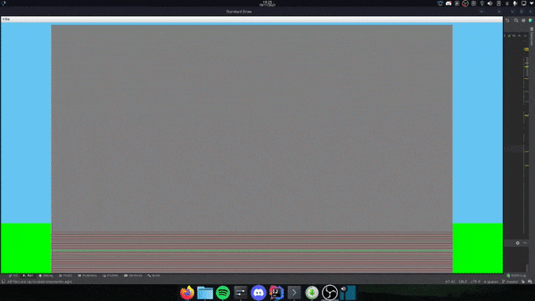

# Ex1 OOP class - ariel CS

## Brief overview

In this assigment we were requested to make an offline algorithm for a building with elevators. We were given a tester,
and some scenarios to try. Our algorithm used the same techniques as our
[online algorithm](https://github.com/Daniel-Ros/ex0/) from Ex0. It was a greedy algorithm that estimated the cost of
every call on every elevator, and the call would be given to the elevator that will loss less time.

Here are some useful resources that I used and helped me with the algorithm:

https://elevation.fandom.com/wiki/Destination_dispatch

https://github.com/do-ryan/destination-dispatch-elevator-simulation

https://www.youtube.com/watch?v=xOayymoIl8U

https://github.com/Daniel-Ros/OOP1

## Algorithm

We implemented the same greedy algorithm that we used in Ex0 but with some changes to how the position is tracked. The
goal in this algorithm is to try and calculate the amount of time ot will take each elevator to finish it's current and
the new call given, the elevator with the lowest time is the elevator we will assing the call to.

## Folder Structure

The workspace contains two folders by default, where:

- `Ex1_Buildings`: the folder with all the building to the scenarios
- `Ex1_Calls`: the folder with all the calls files
- `.`: the folder with the code itself and the tester

## class structure

being an OOP course we had to make our classes to accomplish out desired algorithm. The classes we implemented are:

|Name|Description|
|----|---|
|Algorithm|The class for our algorithm|
|Simulator|The class for simulation and calculating the elevator position / time to finish some tasks|
|Call|A basic data structure to hold the calls|
|Building|A basic data structure to hold the building with its elevators|
|Elevator|A basic data structure to hold the elevator|

## Testing

this project was test using the UniTest library. the tests can be run by an IDE of choice.

## Running the simulation

Make sure you have java (tested on 1.8.0_292) and python 3 install and configured on you machine. clone the project:

    git clone https://github.com/Daniel-Ros/OOP2.git

run the python script:

    python3 Ex1.py <Building json> <Calls csv> <output name>

run the simulator

    java -jar Ex1_checker_V1.2_obf.jar 1111,2222,3333 <Building json> <output name> <output log file>

or use the python script that runs all the combination of building/calls that are in the correct folders:

    git clone https://github.com/Daniel-Ros/OOP2.git
    python3 run_all.py

then a file name `detailed_report.csv`will appear with all the building/calls combination runs

## Results

These are the final results that I was able to get
> There were some stages that I got a bit more, but really hurted other stages, soI had to balance it

|building| calls file| avg_time| uncompleted_calls| certificate|
|---|-----|----|----|----|
|Ex1_Buildings/B1.json|Ex1_Calls/Calls_a.csv|112.92|0|-254611173|
|Ex1_Buildings/B1.json|Ex1_Calls/Calls_b.csv|1784.24364022404|963|-4812623036|
|Ex1_Buildings/B1.json|Ex1_Calls/Calls_c.csv|1839.36031218997|958|-4474949366|
|Ex1_Buildings/B1.json|Ex1_Calls/Calls_d.csv|1841.69849769995|950|-4422944342|
|Ex1_Buildings/B2.json|Ex1_Calls/Calls_a.csv|46.24|0|-290936543|
|Ex1_Buildings/B2.json|Ex1_Calls/Calls_b.csv|1783.46564022404|963|-4813976071|
|Ex1_Buildings/B2.json|Ex1_Calls/Calls_c.csv|1838.30531218997|958|-4470029667|
|Ex1_Buildings/B2.json|Ex1_Calls/Calls_d.csv|1840.91049769995|950|-4427977959|
|Ex1_Buildings/B3.json|Ex1_Calls/Calls_a.csv|27.07|0|-497943606|
|Ex1_Buildings/B3.json|Ex1_Calls/Calls_b.csv|443.074326720002|140|-1129010868|
|Ex1_Buildings/B3.json|Ex1_Calls/Calls_c.csv|469.976041285|37|-2024339219|
|Ex1_Buildings/B3.json|Ex1_Calls/Calls_d.csv|451.000991424002|64|-1156741974|
|Ex1_Buildings/B4.json|Ex1_Calls/Calls_a.csv|19.94|0|-466195294|
|Ex1_Buildings/B4.json|Ex1_Calls/Calls_b.csv|143.626038048|1|-89100201|
|Ex1_Buildings/B4.json|Ex1_Calls/Calls_c.csv|145.522|0|-100150008|
|Ex1_Buildings/B4.json|Ex1_Calls/Calls_d.csv|139.084|0|-79484006|
|Ex1_Buildings/B5.json|Ex1_Calls/Calls_a.csv|15.43|0|-456579370|
|Ex1_Buildings/B5.json|Ex1_Calls/Calls_b.csv|36.859|0|-524830233|
|Ex1_Buildings/B5.json|Ex1_Calls/Calls_c.csv|35.038|0|-521468334|
|Ex1_Buildings/B5.json|Ex1_Calls/Calls_d.csv|35.352|0|-521468334|

> all results were uploaded to the Google form

## Assigment Instructions

Google doc : [here](https://docs.google.com/document/d/1D4aW2vRaKjwtSBY1gDyCC6SNRE5TRGwMerGIXUMkI_Y/edit?usp=sharing)

Testing jar : [here](https://github.com/benmoshe/OOP_2021/tree/main/Assignments/Ex1/libs)

GitHub: [project files](https://github.com/benmoshe/OOP_2021/tree/main/Assignments/Ex1)

Google
Form: [here](https://docs.google.com/forms/d/e/1FAIpQLSffojCP9ftLSlk58_opDf-OpcLXvmuYzoQ3N_EQGtfozXjfjA/viewform?usp=sf_link)

Reported results (by
students) : [here](https://docs.google.com/spreadsheets/d/1fyFWvU_8d8UeaiUdyDujfgvt2dMs2mzzLd9QgUb33Wc/edit?usp=sharing)

## Bonus Graphic Simulation

youtube (bonus section ,
made in Java StdDraw) : [here](https://www.youtube.com/watch?v=yp0BwQUdc-o)

Blue = Call , Yellow = Call destination , Green = Elevator , Light Green = Zero floor 

> Sample from youtube video
